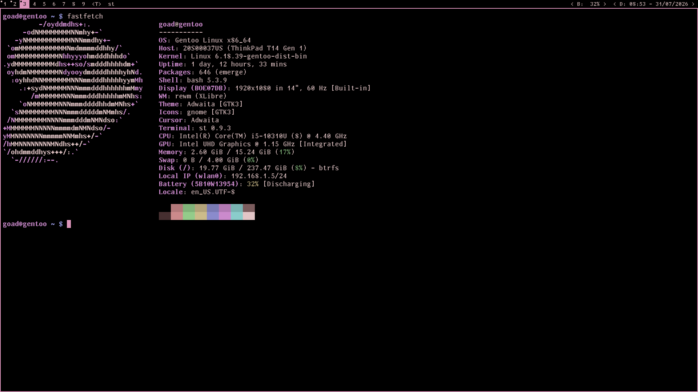

# rewm - JIT-reloadable X11 window manager



`rewm` is not minimal, **dwm-style X11 window manager** where WM logic is compiled at runtime using a CMM JIT pipeline (which is a fork of MIR c2mir).

Instead of rebuilding and restarting the WM for every logic change, you edit the WM source and reload to apply your latest changes.
By this design you are not only stuck with the default dwm-style wm, you can modify the `src/wm.c` live to make it floating wm etc...

---

## Important warning

This WM can use **more RAM than expected**.
It is effectively a **C-compatible compiler/runtime pipeline bundled with X11/window-management libraries**, not just a tiny static WM binary.

If you want extremely low memory overhead, this design may not match your expectations.

---

## What it is

- Native host process managing X11 connection and lifecycle
- Runtime compilation of WM logic (`src/wm.cmm`) through CMM
- Reload-oriented architecture where runtime state is designed to survive recompiles
- Tile/monocle/floating style behavior (you can add more live since this JIT compiled)

---

## High-level architecture

- **Host layer** (native binary):
  - Initializes display and WM state
  - Compiles/recompiles WM logic
  - Enters WM entrypoint and handles reload loop

- **JIT/compiler layer**:
  - Compiles WM source at runtime
  - Resolves required symbols (X11/libc/etc.)
  - Produces executable machine code

- **WM logic layer** (`src/wm.cmm`):
  - Event loop and key/mouse handling
  - Client/window lifecycle
  - Layout behavior (tile/monocle/floating)
  - Returns control flags like reload/quit

---

## Requirements

Typical Linux/X11 dependencies:

- `gcc`
- `libX11`
- `libXft`
- `fontconfig`
- `libXinerama`
- standard C runtime/development tooling (`dl`, `m`, `pthread` link deps where needed)

> Package names vary by distribution (`-dev` / `-devel` variants).

---

## Build

From repository root:

```sh
gcc build.c -o nob
./nob
```

This should produce the `rewm` executable.

---

## Launch

Use this example to launch rewm:

```sh
export REWM_PATH="$HOME/Documents/dev/rewm/src/"
export REWM_CFLAGS="-I/usr/include/freetype2"
exec $HOME/Documents/dev/rewm/rewm &> /tmp/rewmlog
```

---

## Hot-reload workflow

1. Start `rewm`
2. Edit WM logic source
3. Trigger reload path (default is `Win+Shift+r`)
4. Host recompiles and re-enters WM logic
5. WM state is intended to persist across reloads

---

## NOTE

This WM created with the assist of _LLM_ if you don't like that just skip it. 
